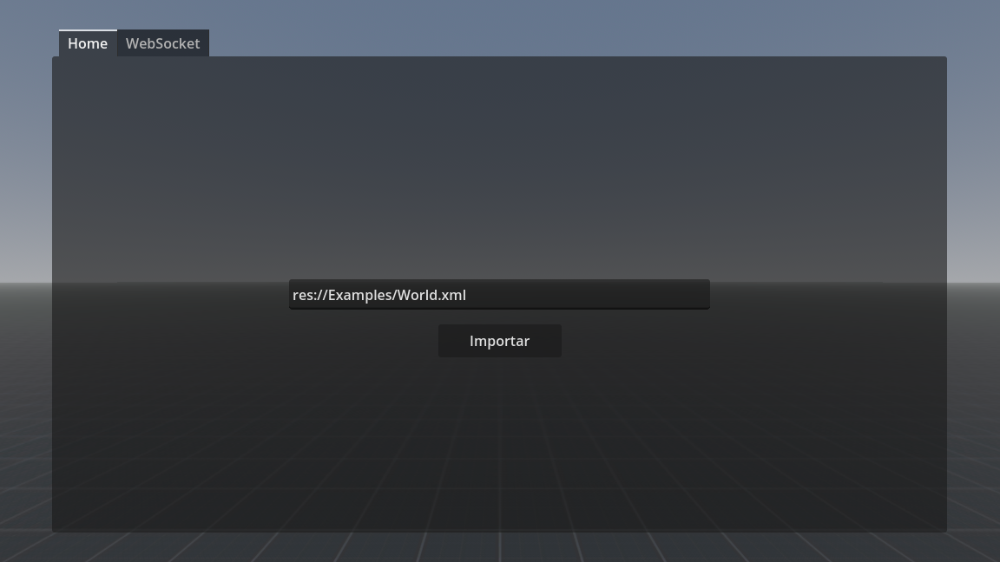
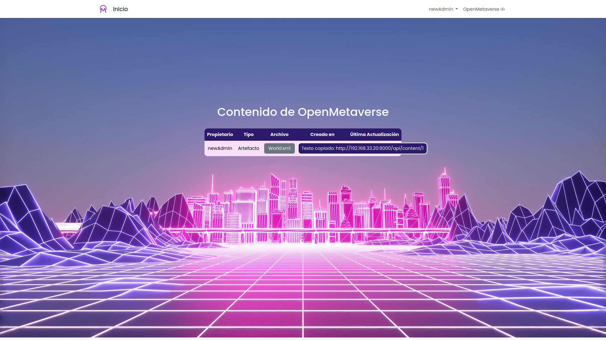
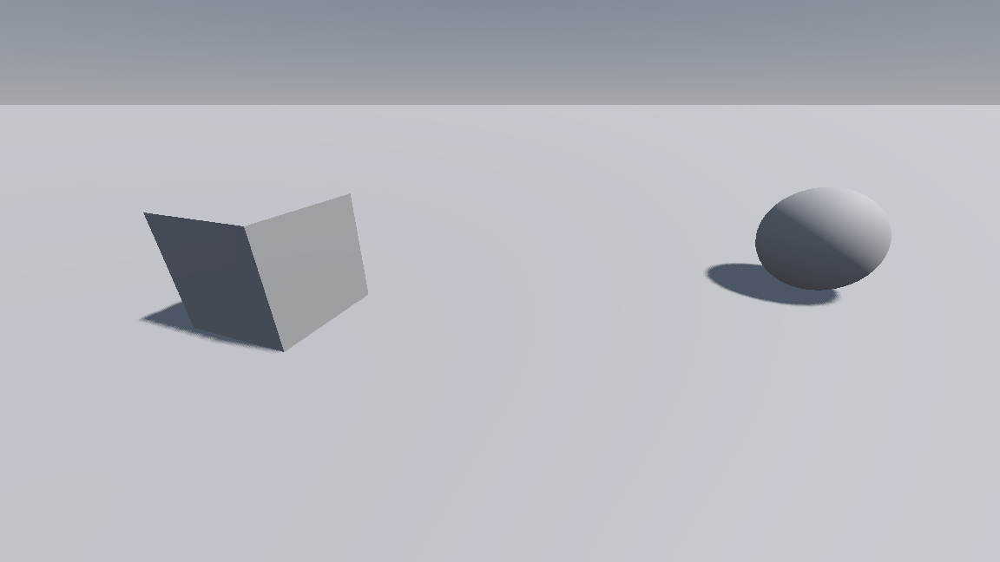
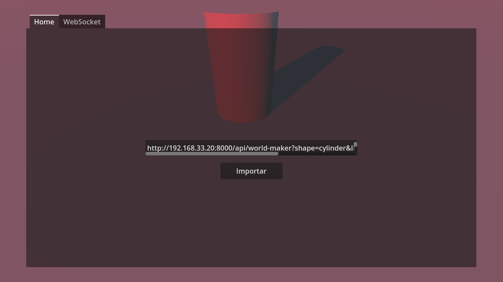
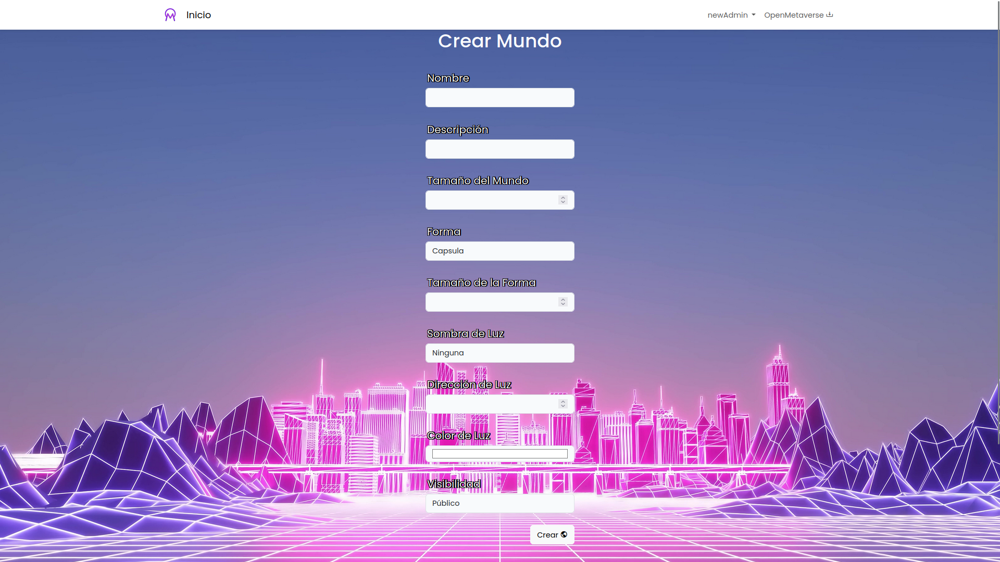

# Servidor de gestión de contenido VR Open Metaverse

Esta aplicación web es capaz de gestionar usuarios, permisos y contenido en tres categorías: mundos, avatares y artefactos, además de tener un pequeño editor de mundos para poder personalizarlos y un cliente que puede interpretarlos en 3D.

## Autores
Alejandro Franco  
José Miguel Lunisa  
Daniel Píriz

## Usuarios Testing

**Administrador:** admin@gmail.com | password  
**Usuario:** test@gmail.com | password

## Página web

## Cliente personalizado

Al ejecutar el programa, se abre una ventana que pide introducir una ruta. Esta ruta puede ser interna del propio equipo, o HTTP/HTTPS:

Para conseguir la ruta de un contenido subido a la plataforma, basta con hacer click sobre el nombre del archivo:

De vuelta en el cliente, basta con pegar el enlace en campo y hacer click en "importar" para cargar el mundo. Es importante mencionar que, dado que el cliente no tiene autenticación, el mundo debe estar marcado como público para poder ser descargado, si no, recibirá un error 403 (recurso prohibido):

Es posible pulsar **ESC** para abrir y cerrar el menú, y moverse por el escenario:
* W, A, S, D: movimiento
* Ratón / flechas: cámara
* Barra espaciadora: saltar

## Creador de mundos

El creador de mundos es una API para generar mundos sencillos con un nombre, una descripción, un tamaño del suelo, una forma geométrica, su tamaño, un tipo de sombra para la luz direccional, un ángulo, y un color:

Con esto es posible generar una llamada que devuelve un mundo con dichas características, aunque su uso habitual no es práctico por sí solo. Por ello, existe un creador de mundos que utiliza la API de forma interna para generar y guardar un mundo en la base de datos.

